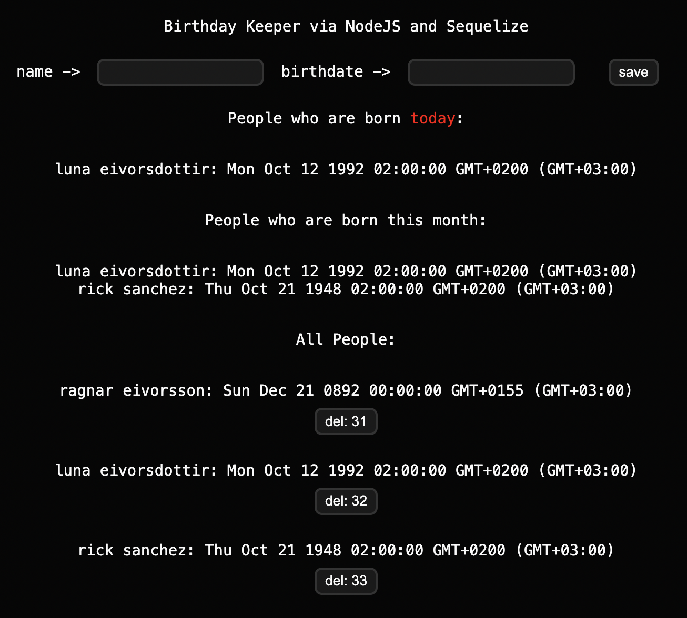

# birthday-keeper

Birthday-keeper is a simple Node.js program in order to do understand and practice basics of using Node.js with a Sequelize database.

Any user is able to give names and a related birthdays as inputs. Among these people, if there are someone(s) whose birthday is in this month, or today is their birthday, program shows that informations on the screen, separately.



## usage 

After installing the source code: 

```
cd birthday-keeper/backend
npm i
npm run dev
```

Then the app will appear on http://localhost:3030/. 

Input `name` can be any string. Input `birthdate` must be taken as the format YYYY-MM-DD for the program to run correctly.